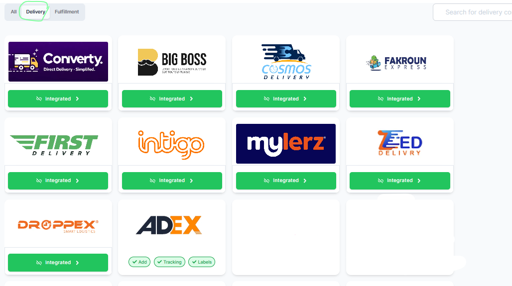

# nootbook-lm-bridge

This repository is dedicated to the **nootbook-lm-bridge** project. 

The project aims to provide a bridge or integration layer, likely between notebook-style environments and large language models (LLMs).

## Project Updates
- **Initial Setup**: Repository created and initialized with this README file.
- **Data Update (May 31, 2026)**: Added delivered orders data for 2025 and 2026.

## Delivered Orders Data

| Month | Year | CAKADO | Balkis | NoRetour | Total (Delivered Orders) |
| :--- | :--- | :--- | :--- | :--- | :--- |
| May | 2026 | 306 | 259 | 23 | 588 |
| April | 2026 | 389 | 203 | 14 | 606 |
| March | 2026 | 501 | 459 | 0 | 960 |
| February | 2026 | 441 | 404 | 10 | 855 |
| January | 2026 | 779 | 402 | 18 | 1199 |
| December | 2025 | 497 | 455 | 51 | 1003 |
| November | 2025 | 505 | 320 | 13 | 838 |
| October | 2025 | 634 | 681 | 37 | 1352 |
| September | 2025 | 710 | 659 | 0 | 1369 |
| August | 2025 | 501 | 418 | 0 | 919 |
| July | 2025 | 566 | 319 | 0 | 885 |
| June | 2025 | 291 | 109 | 0 | 400 |
| May | 2025 | 347 | 228 | 0 | 575 |
| **Total** | | **6467** | **4916** | **166** | **11549** |

## Chosen Delivery Company: Cakado Partnership

